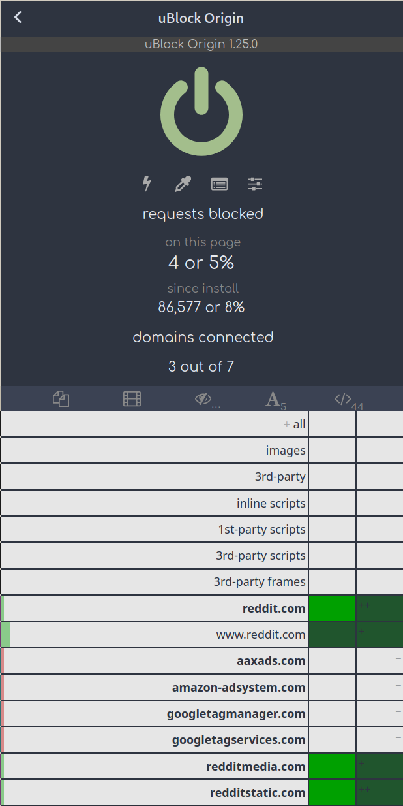
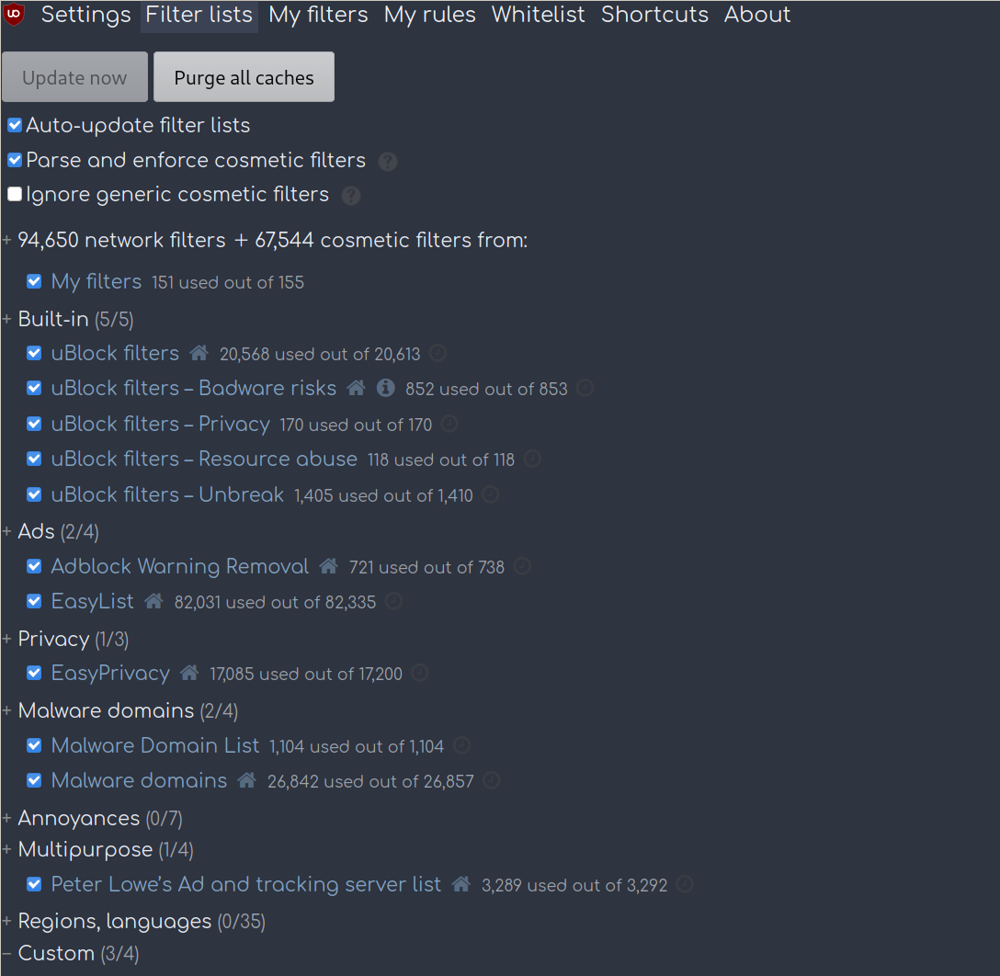
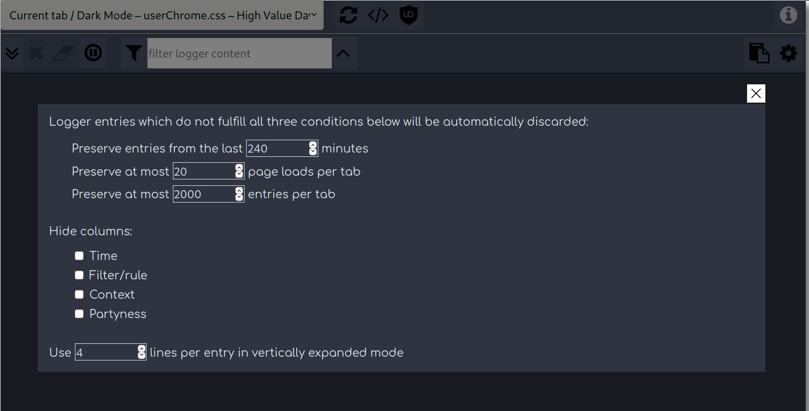
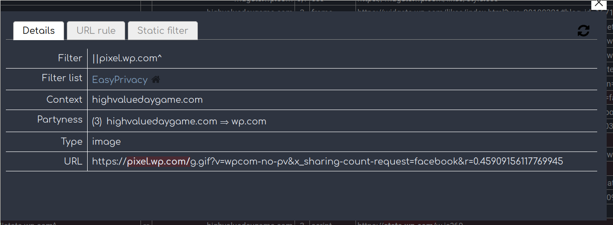

# FireFox-uBo-rice
This will assist you in creating your own dark or color theme for uBlock Origin.  Or really any extension.  As long as you get the Internet UUID and sift through the elements and selectors.  

I will be adding other themes to the /riceExtension folder at a later time.

See screenshots below for a preview.

